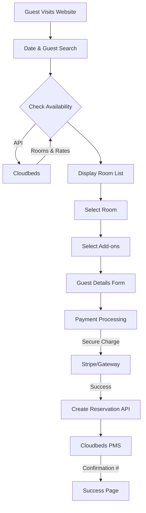

# Hennessey Estate Booking Engine - Research & Gap Analysis

## Executive Summary
The current codebase contains a robust **Staff Management Dashboard** (Revenue Audit, Competitive Benchmark, Daily Reservations) but lacks a public-facing **Guest Booking Engine**. While the core components (`RoomList`, `BookingForm`, `PaymentForm`) exist, they are not wired into a cohesive guest user flow.

## Current State Analysis

### 1. Existing Foundation
- **Backend (`server/index.js`)**: 
  - Functional integration with Cloudbeds API v1.2.
  - Endpoints for Availability (`/getAvailableRoomTypes`), Reservations (`/postReservation`), and Reporting.
  - **Hennessey Specifics**: Property ID `49705993547975` is configured.
  - **AI Integration**: Advanced Gemini-powered concierge and revenue analysis tools are built.

### 2. Frontend Components
- **`RoomList.js`**: Capable of displaying rooms, amenities, and prices.
- **`BookingForm.js`**: Collects guest details (Name, Email, Address).
- **`PaymentForm.js`**: Collects credit card information (Note: Security implication).
- **`App.js`**: Currently configured as a Manager Dashboard. **Missing a `/book` or Guest Mode route.**

## Critical Gaps & Recommendations

### 1. Guest Booking Flow (The "Engine")
**Current Status**: Components exist but are isolated.
**Recommendation**: Create a dedicated "Guest Mode" or standalone `/book` route that implements the standard flow:
1.  **Search**: Date & Guest count selection.
2.  **Select**: Room selection (using `RoomList`).
3.  **Enhance**: Add-ons selection (Breakfast, Cleaning, Experiences).
4.  **Details**: Guest information (using `BookingForm`).
5.  **Payment**: Secure processing (using `PaymentForm` or external provider).
6.  **Confirm**: Success page with reservation details.

### 2. Payment Security (Critical)
**Current Status**: The server uses `/postReservationPayment` sending raw credit card numbers (`card_number`, `cvv`) to Cloudbeds.
**Risk**: This requires the server to be PCI-DSS compliant. Transmitting raw card data via a standard web server is a security risk and often prohibited by API terms.
**Recommendation**: 
- **Preferred**: Integrate a payment gateway like **Stripe** or **PayPal** on the frontend. Process the charge securely, then send the *transaction result* to Cloudbeds as a payment record.
- **Alternative**: Use Cloudbeds "Pay by Link" or Hosted Payment Page if available via API (requires further API investigation).
**Research Update**: Cloudbeds API explicitly prohibits sending unencrypted credit card data. The current implementation will likely be rejected. The recommended secure path is "Pay-by-Link" (redirecting the guest to a secure page hosted by Cloudbeds/Processor) or using a tokenized gateway (Stripe) and syncing the payment.

### 3. "Total Buyout" & Inventory Logic
**Current Status**: "Total Buyout" (booking all rooms) is mentioned in documentation but likely requires manual logic.
**Recommendation**: Implement a "Virtual Room" check on the backend:
- If "Total Buyout" is selected, verify *ALL* physical rooms are available.
- If booked, automatically create reservations for (or block) all physical rooms to prevent double booking.

### 4. Add-ons & Extras
**Current Status**: Services like Breakfast and Cleaning are handled via Custom Fields in the backend but not exposed in the frontend.
**Recommendation**: 
- Add an "Enhancements" step between Room Selection and Guest Details.
- Allow users to select "Daily Cleaning", "Breakfast", "Wine Tour", etc.
- Map these selections to `customFields` or `addons` in the Cloudbeds reservation payload.

## Proposed Architecture for Hennessey Estate Engine

## Next Steps
1.  **Scaffold Guest Route**: Create `GuestApp.js` or a router in `App.js` to handle the booking flow.
2.  **Wire Components**: Connect `AvailabilityChecker` -> `RoomList` -> `BookingForm`.
3.  **Secure Payment**: Replace raw card transmission with a secure tokenization flow or mock integration for now.
4.  **Implement Add-ons**: Add a UI step for Hennessey-specific extras.
